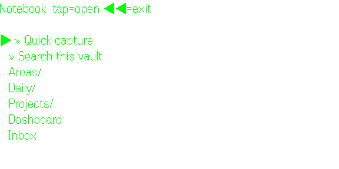
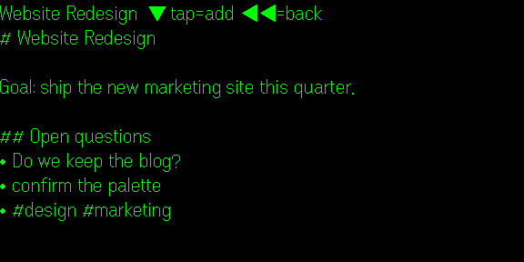
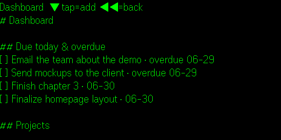
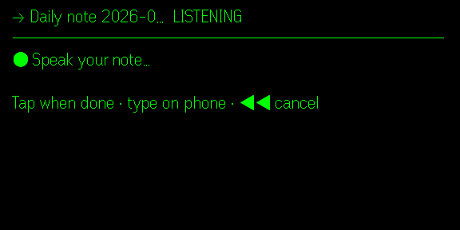

# Gbsidian

**Your Obsidian vault on your glasses — self-hosted, private, hands-free.**

View and voice-capture your [Obsidian](https://obsidian.md) notes on
[Even Realities G2](https://www.evenrealities.com/) smart glasses. A tiny backend runs on **your own
computer**, reads your vault files directly, and is reachable **only over your own Tailscale network** —
no central server, no accounts, no analytics. Your notes never leave your machine.

<p align="center">
  
</p>

## What it looks like

| Open straight into your vault | Read a note, flattened to clean lines |
|:---:|:---:|
|  |  |
| **Tasks & Dataview rendered live** | **Hands-free voice capture** |
|  |  |

<sub>Screenshots use a demo vault — not real notes.</sub>

## Features

- **Glance & read** — pick a vault on your phone; the glasses open straight into it. Browse the folder
  tree and read notes rendered to clean lines (Obsidian markdown flattened: wikilinks, callouts, tasks,
  tables, headings).
- **Live Tasks & Dataview** — `tasks` and `dataview` (LIST/TASK) query blocks render as live results —
  great for a "what's due today" view. Common **task dashboards built with `dataviewjs`** render too
  (the embedded query is extracted; no JavaScript is executed). Anything outside the supported subset
  shows a placeholder rather than a wrong answer.
- **Search** — by full text, filename, or tag.
- **Voice capture** — speak a thought into today's daily note (or an inbox), or append to the note
  you're reading — hands-free. No voice key? Type on the phone instead.
- **Private by design** — loopback-bound, token-required, tailnet-only. The developer runs no server
  and collects nothing.

3 gestures: **tap** = open / capture · **double-tap** = back · **swipe** = scroll.

## Quick start

You self-host Gbsidian — your notes stay on your machine. You need **Python 3.10+** and **Tailscale**
(logged in). No build tools required — the app is one published build.

1. **Backend** — clone and run the installer (sets up a `systemd --user` service and serves it
   tailnet-only over HTTPS on the default `:443` so the app's `*.ts.net` whitelist matches it):
   ```bash
   git clone https://github.com/liyiyuian/g2sidian && cd g2sidian && ./install.sh
   ```
   It auto-discovers your Obsidian vaults, generates a token, and prints a `g2sidian:…` config line
   (and a QR) for the phone.
2. **App** — install **Gbsidian** from [hub.evenrealities.com](https://hub.evenrealities.com). One
   public build works with any backend — nothing to rebuild.
3. **Connect** — open **Gbsidian → Setup → Paste config**, paste the line, and pick a vault.

More detail (and a from-source build path): **[SETUP.md](SETUP.md)**.

> **Self-hosted, one build for all:** the app ships a wildcard (`*.ts.net`) network whitelist, so a
> single published build connects to *your* backend (entered in Setup) without baking anyone's
> address in. Serve your backend on the default `:443` (a plain `https://<host>.<tailnet>.ts.net`
> URL) so the wildcard matches — only one app can own the `:443` root per machine.

## How it works

- **Backend** (`g2sidian_api.py` + `md_flatten.py` + `vault_query.py`) — Python **stdlib** HTTP control
  plane on your computer. Reads/writes the vault `.md` files directly (no Obsidian process or plugin
  needed), exposes a token-auth JSON API on `127.0.0.1:8793`, published tailnet-only via `tailscale
  serve`. Writes are append-only, atomic, conflict-checked, and byte-preserving (frontmatter untouched).
- **Glasses app** (`glasses/`) — Vite + React + [`even-toolkit`](https://www.npmjs.com/package/even-toolkit)
  Even Hub plugin. Per-user backend URL + token entered once in a phone Setup screen; no secrets baked in.

## Privacy & security

The backend reads and writes your notes — treat it as a sensitive surface. It **requires a token**,
binds **loopback only**, and is reachable **only over your tailnet**. Never bind `0.0.0.0`, never share
the token, never commit `~/.config/g2sidian.env`. Voice transcription is optional and only used if you
add your own OpenAI Whisper key; if enabled, dictated audio is sent to OpenAI to transcribe (see
[store-assets/privacy.txt](store-assets/privacy.txt)).

## License

[MIT](LICENSE).
